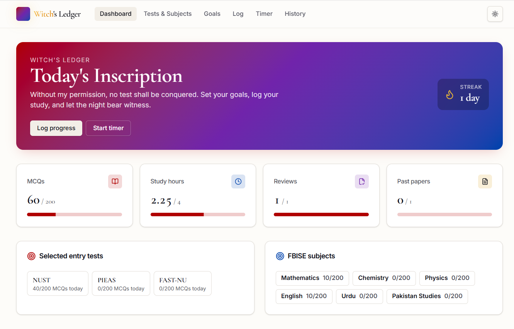
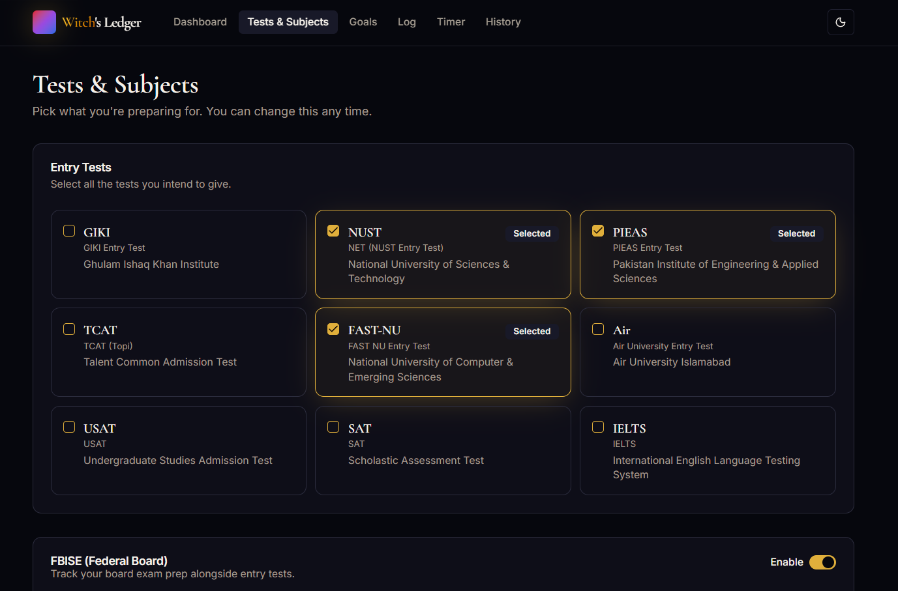
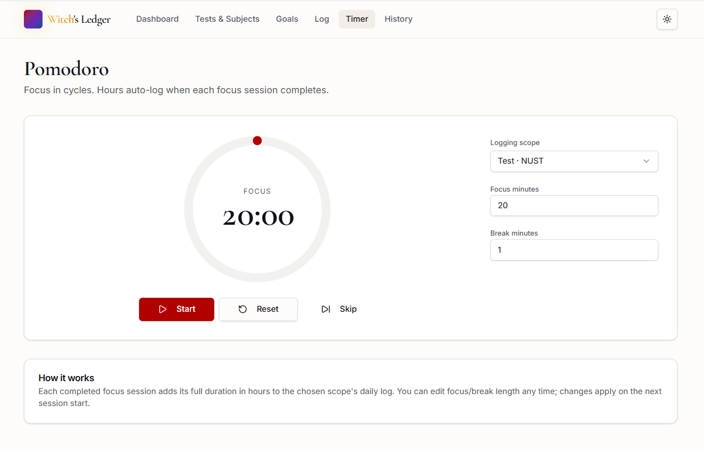

<div align="center">

# 🦋 Witch's Ledger

### *When the seagulls cry, they are crying over your unfinished past papers.*

A **local-first**, Umineko-themed entry test & board exam preparation tracker for Pakistani students.
Built with React 19, TanStack Router, and Tailwind CSS v4.

[](https://github.com/)
[](https://react.dev/)
[](https://tanstack.com/router)
[](https://tailwindcss.com/)
[](https://www.typescriptlang.org/)
[](https://vite.dev/)
[](https://www.gnu.org/licenses/agpl-3.0)


---

[✨ Features](#-features) · [📸 Screenshots](#-screenshots) · [🚀 Getting Started](#-getting-started) · [📖 Usage Guide](#-usage-guide) · [🗺️ Roadmap](#%EF%B8%8F-roadmap) · [🤝 Contributing](#-contributing)

</div>

---

## ✨ Features

### 🎯 Entry Test Support
Track preparation for all major Pakistani university entry tests:

| Test | Institution |
|------|------------|
| **GIKI** | Ghulam Ishaq Khan Institute |
| **NUST** | National University of Sciences & Technology |
| **PIEAS** | Pakistan Institute of Engineering & Applied Sciences |
| **FAST-NU** | FAST National University |
| **Air** | Air University |
| **USAT** | Undergraduate Studies Admission Test |
| **SAT** | Scholastic Assessment Test |
| **IELTS** | International English Language Testing System |
| **TCAT** | Taxila Competency Assessment Test (sometimes referred to as the UET Taxila Entry Test) |

### 📚 FBISE Board Exam Support
Prepare for Federal Board (FBISE) intermediate exams across all major programs:

| Program | Subjects |
|---------|---------|
| **Pre-Medical** | Biology · Chemistry · Physics |
| **Pre-Engineering** | Mathematics · Chemistry · Physics |
| **ICS (Physics)** | Mathematics · Computer Science · Physics |
| **ICS (Statistics)** | Mathematics · Computer Science · Statistics |

> **Note:** English, Urdu, and Pakistan Studies are included as compulsory subjects across all FBISE programs.

### 🎯 Goals System
- **Global daily goals** — set targets like 200 MCQs, 4 study hours, review sessions, or past paper practice
- **Per-subject goals** — fine-tune targets for each individual subject
- All goals are fully **customizable** and persist locally

### ⏱️ Pomodoro Timer
- Built-in Pomodoro timer with configurable work/break intervals
- **Auto-logs study hours** on completion — no manual entry needed
- Session history tracked per subject

### 📊 Dashboard & History
- **Streak tracking** — maintain and visualize your daily study streak
- **14-day history view** — see your progress over the past two weeks
- Visual charts powered by Recharts

### 🌙 Theme System
- **Umineko-inspired palette** — golden amber, deep crimson, midnight blue, and regal purple
- **Minimalist mode** — clean black-and-white aesthetic
- **Dark / Light mode** — manual toggle in the header
- **OS preference detection** — follows your system theme by default

---

## 📸 Screenshots

<!-- > *(Add screenshots here once the app is deployed)* -->

| Dashboard | Tests & Subjects | Pomodoro Timer |
|:---------:|:----------------:|:--------------:|
|  |  |  |

---

## 🚀 Getting Started

### Prerequisites

Before you begin, make sure you have the following installed:

| Tool | Version | Notes |
|------|---------|-------|
| **Node.js** | ≥ 20.x | [Download](https://nodejs.org/) — LTS recommended |
| **npm** | ≥ 10.x | Bundled with Node.js |
| **Git** | Any | [Download](https://git-scm.com/) |

> **Tip:** Use [nvm](https://github.com/nvm-sh/nvm) (Linux/macOS) or [nvm-windows](https://github.com/coreybutler/nvm-windows) to manage Node versions easily.

### Installation

**1. Clone the repository**

```bash
git clone https://github.com/cevique/Witchs-Ledger.git
```

**2. Navigate into the project folder**

```bash
cd witchs-ledger
```

**3. Install dependencies**

```bash
npm install
```

This will install all production and development dependencies, including React 19, TanStack Router, Radix UI, Tailwind CSS v4, and the full Vite toolchain. Expect around 300–500 MB in `node_modules`.

**4. Start the development server**

```bash
npm run dev
```

Open your browser and go to **[http://localhost:5173](http://localhost:5173)** (or whichever port Vite picks). You're ready to study.

---

### Available Scripts

| Command | Description |
|---------|-------------|
| `npm run dev` | Start the Vite development server with hot module replacement |
| `npm run build` | Production build (outputs to `dist/`) |
| `npm run build:dev` | Development build (useful for debugging bundled output) |
| `npm run preview` | Preview the production build locally |
| `npm run lint` | Run ESLint across the entire codebase |
| `npm run format` | Auto-format all files with Prettier |

---

### Tech Stack

| Layer | Technology |
|-------|-----------|
| **Framework** | [React 19](https://react.dev/) |
| **Routing** | [TanStack Router v1](https://tanstack.com/router) |
| **Server State** | [TanStack Query v5](https://tanstack.com/query) |
| **Build Tool** | [Vite 7](https://vite.dev/) |
| **Styling** | [Tailwind CSS v4](https://tailwindcss.com/) |
| **UI Primitives** | [Radix UI](https://www.radix-ui.com/) (full suite) |
| **Charts** | [Recharts](https://recharts.org/) |
| **Forms** | [React Hook Form](https://react-hook-form.com/) + [Zod](https://zod.dev/) |
| **Icons** | [Lucide React](https://lucide.dev/) |
| **Date Utilities** | [date-fns](https://date-fns.org/) |
| **Notifications** | [Sonner](https://sonner.emilkowal.ski/) |
| **Language** | TypeScript 5.8 |
| **Deployment** | Cloudflare Pages (via `@cloudflare/vite-plugin`) |
| **Storage** | Local-first (localStorage / IndexedDB) |

---

## 📖 Usage Guide

### 1. Pick Your Tests
Go to **Tests & Subjects** → select all the entry tests or FBISE programs you're preparing for. Each selected test/subject gets its own goal and progress tracking.

### 2. Set Your Goals
Go to **Goals** → configure:
- **Daily MCQ target** (default: 200, fully changeable)
- **Daily study hours** (default: 4 hours)
- **Review sessions**
- **Past Papers / Model Papers**

You can set goals both globally and per-subject.

### 3. Log Progress
Either manually log your study sessions, or just **run the Pomodoro timer** — it auto-logs hours when a session completes.

### 4. Track Streaks & History
The **Dashboard** shows your current streak and an overview of recent activity. The **History** page provides a full 14-day breakdown.

### 5. Toggle Theme
Use the **theme switcher in the header** to switch between the Umineko color palette, minimalist black/white, dark mode, or light mode. By default, the app respects your OS preference.

---

## 🗺️ Roadmap

- [x] Entry test selection (GIKI, NUST, PIEAS, TCAT, FAST-NU, Air, USAT, SAT, IELTS)
- [x] FBISE board exam support with all compulsory subjects
- [x] Global + per-subject daily goals (MCQs, hours, review, past papers)
- [x] Pomodoro timer with auto-logging
- [x] Streak tracking & 14-day history
- [x] Umineko theme (gold/red/blue/purple) + minimalist B&W
- [x] Dark / Light mode with OS preference detection
- [ ] **Server-side auth** — multi-user support with email/password login *(coming soon)*
- [ ] Cloud sync & cross-device support
- [ ] Study group / leaderboard features
- [ ] Notifications & reminders
- [ ] Mobile app (PWA)
- [ ] Export progress reports (PDF)

---

## 🤝 Contributing

Contributions are warmly welcome! Whether it's a bug fix, new feature, or a typo in the docs — every PR matters.

**Steps to contribute:**

```bash
# 1. Fork the repository on GitHub

# 2. Clone your fork
git clone https://github.com/cevique/Witchs-Ledger.git

# 3. Create a feature branch
git checkout -b feature/your-feature-name

# 4. Make your changes, then commit
git commit -m "feat: add your feature description"

# 5. Push and open a Pull Request
git push origin feature/your-feature-name
```

Please follow the existing code style (`npm run lint` and `npm run format` before committing).

### Contributors

<a href="https://github.com/cevique/Witchs-Ledger/graphs/contributors">
  
</a>

---

## ⭐ Support the Project

If this tracker helped you get into your dream university, consider:

- **Starring the repo** — it genuinely helps with visibility ⭐
- **Sharing it** with other students preparing for entry tests
- **Opening issues** to report bugs or suggest features
- **Submitting a PR** to improve the codebase

### Sponsor / Buy Me a Coffee

If you'd like to support continued development:

[](https://ko-fi.com/cevique)
[](https://github.com/sponsors/cevique)
<!-- [](https://paypal.me/cevique) -->

---

## 📄 License

This project is licensed under the **AGPL v3.0 License** — see the [LICENSE](LICENSE) file for details.

Forks MUST stay open. You are free to use, modify, and distribute this project, as long as attribution is maintained.

AGPL v3  closes the SaaS loophole. If someone runs this code as a web service, they must still publish source.

---

<div align="center">

*"Then I'll tell you something crucial. No matter how many times you repeat it, the future cannot be changed."*
*— Beatrice, Umineko no Naku Koro ni*

**Made with ☕ and existential dread by a fellow Pakistani student.**

</div>
